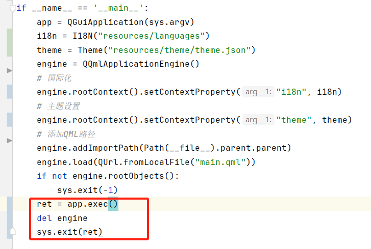

  

<h1 align="center">
  Qt Open UI(正在开发中...)
</h1>

  基于PySide6 + QML，面向QtQuick开发者的组件库。

  

## Features
- 国际化
- 主题切换
- 基础组件
- ......

## License
This QtOpenUI library currently licensed under [MIT License](./LICENSE)

## 踩坑记录
### 1.模块化管理QML时, qmldir和xxx.qml文件存放在同一个目录且module名称必须为目录名称。
暂时不知道为什么会这样，根本原因待研究！
### 2.当使用属性绑定(engine.rootContext().setContextProperty("i18n", i18n))时，点击右上角x按钮关闭应用，qml偶尔出现 TypeError: Cannot read property 'xxx' of null
怀疑是i18n对象先于qml被销毁回收，导致出现类似空指针异常。网上说将i18n对象先于engine创建，
但是我尝试之后并未解决问题。最后尝试在执行app.exec()之前显示调用del engine后，暂未再出现该异常。根本原因待研究！

